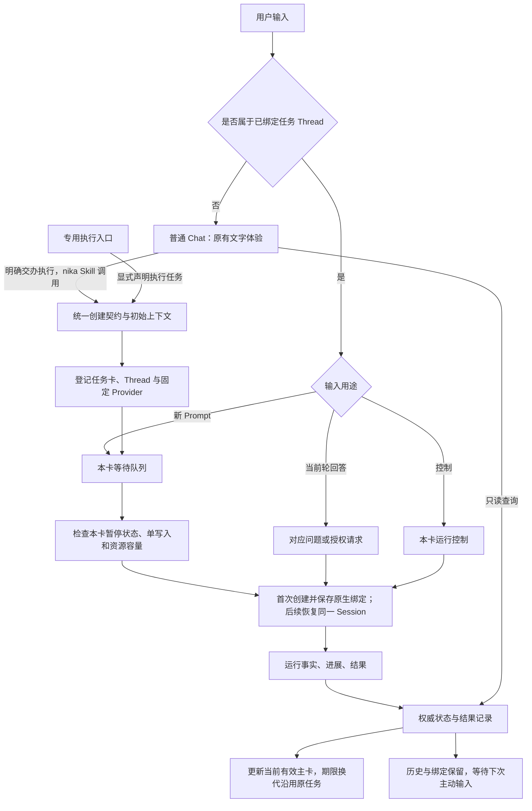

# yomi / nika 任务卡技术方案：开发流程、行为契约与取舍

研究日期：2026-09-28；成稿及评审收敛日期：2026-09-29。状态：N1–N12、L1 与交付路线的方案选择全部闭合；N1–N8 已逐项确认，N9 明确同意，N10–N12 与交付路线按用户“之后的都按照你的建议收敛”授权确认。实现与能力验收仍待进行，尤其展开态、期限换代、双 Provider 停止/恢复及升级兼容。需求依据为 [需求基线 R1–R7、D1–D12](chat-flow-requirements.md)。方案获批不等于功能已交付或平台能力已实测通过。

[云端开发入口](chat-flow-handoff.md) 和 [决定上下文](chat-flow-context.md) 与本文一并维护于仓库，不依赖本机资料。

本文面向流程 review：解释每个节点为什么开发、如何运转、与谁交接、怎样判断做对。正文不包含实现代码、数据库表结构或协议报文。具体源码与官方接口证据放在末尾研究材料中。

## 1. 先给评审结论

已确认建立一条确定的执行链：**nika Skill 或专用执行入口调用同一创建契约 → yomi 固定任务与 Session 的关系 → 原始输入按任务排队 → Adapter 驱动 Kimi Code / Codex → 运行事实更新当前有效主卡 → 历史保留，后续输入主动恢复原 Session**。普通 Chat 保持原风格，只读查询任务，不参与任务 Thread 后续指令的改写。

这不是单独修改卡片外观。必须同时补齐直接路由、按卡控制、Provider 双向接入、事实状态、结果读取和恢复契约；否则卡片可能“看起来停止了，但后台仍在做”“显示恢复了，实际开了新会话”。

**平台限制与已选处理：Session 长期保留；卡片按 L1 在期限相关场景更换当前代次。** 2026-09-28 核验的飞书官方说明中，已发送卡片更新有效期为 14 天，交互回调有效期为 30 天；CardKit 实体自创建起 14 天有效。此限制不是“14 天没操作”，不能假设定期刷新即可续期。来源见 [飞书处理卡片回调](https://open.feishu.cn/document/uAjLw4CM/ukzMukzMukzM/feishu-cards/handle-card-callbacks) 与 [单卡研究](chat-flow-evidence/feishu-single-card.md)。

2026-09-29 用户明确选择 L1，D12 已修订为**每任务一张当前有效主卡，有效期内同卡多轮，跨期限允许换代，旧卡留作历史**。换代保持同一任务、Session 和执行状态，不按每轮新增结果卡。选择已闭合；原 Thread 延续、换代可靠性和展开态仍分别需要实测，见 §8。

阅读顺序建议：先读 §2–§4 理解语义和总流程；沿 §5 的节点比较方案；用 §6 的契约检查开发是否偏离；最后看 §7 的交付顺序、§8 的平台期限与 L1 换代方案和 §9 的验收矩阵。

**最终决定（2026-09-29）。** 下表固定开发基线，各节点仍保留备选方案及取舍。N9 和剩余推荐方案的确认依据为 [本轮用户确认](chat-flow-context.md#review-final)；它不取消任何待验证门槛，也不将前面已选的组合方案改成统一选 A。

| 节点 | 已确认的开发选择 |
|---|---|
| N1 创建入口 | A+B：nika Skill 与专用执行入口共用创建契约，首版都提供 |
| N2 固定绑定 | A：先提供任务入口，首轮取得资格后创建并持久绑定 Session，再提交指令 |
| N3 队列与资源 | A：每卡队列、统一执行名额；不按代码冲突或业务失败额外编排任务 |
| N4 Provider 进程 | A：活动 Session 独立进程，空闲释放，后续恢复原 Session |
| N5 当前轮回答 | A 主卡控件+B 固定问题引用，共用回应契约 |
| N6 停止与恢复 | A：每卡统一裁定顺序；停止未确认时不预约自动恢复 |
| N7 可信进度 | A：关键事实、当前快照、按需读取历史 |
| N8 单卡呈现 | A 局部更新作为验证路线；L1 按期限更换当前主卡，同任务/Session，效果待实测 |
| N9 完整结果 | A：按轮保存 Agent 原始正文与归属元数据，超限首版导出 Markdown 附件 |
| N10 保留与释放 | A：终态保存后按短空闲期释放进程；历史不自动删除，暂停队列仍由 yomi 保留 |
| N11 主动恢复 | A：启动核对未闭合运行，新输入再载入原 Session；不恢复旧待执行队列 |
| N12 重送与投递 | A：最小受理事实和当前状态，显示按最新版本重试；未知执行不盲重发 |
| 交付路线 | A：先验证风险，再交付可贯通的薄流程，按真实场景补齐异常与多卡 |

## 2. 语义定义：哪些东西是同一件事，哪些不是

| 对象或动作 | 本方案定义 | 直接影响 |
|---|---|---|
| Task，任务 | 用户持续交办的一项工作，包含目标、上下文、当前状态和多轮结果 | 修改接口、补测试可以是同一个 Task 的不同轮次 |
| 任务卡 | Task 的主交互入口；同一代持续更新，按 L1 因期限更换当前有效代次 | Task 身份不等于消息身份；不按每轮发结果卡 |
| 卡片代次 | 同一任务某次发布的主卡消息及 CardKit 实体 | 同一时刻只有一代有效控制入口，历史代次仍能定位原任务 |
| Thread，任务话题 | 飞书中确定输入归属的消息范围 | 进入该 Thread 的新 Prompt 直接属于绑定任务 |
| Provider Session | Kimi Code 或 Codex 保存上下文的原生会话 | Task 首版固定 Provider 与 Session；不能恢复时不悄悄换新 |
| yomi 执行会话 | yomi 为该任务维护路由、排队和运行控制的容器 | 与 Provider Session 对应，但两者身份不混用；不额外跑一次 Chat 模型 |
| Run，一轮运行 | 一条被调度的执行输入在该 Session 中产生的一次尝试 | 排队项尚未开始时不是正在运行；重试建立新 Run |
| 新 Prompt | 用户主动追加的新一轮工作指令，保留原文、附件和引用 | 当前 Run 还在执行时进入同卡队列，不默认打断 |
| 当前轮回答 | 对 Provider 已提出的某个问题或授权请求的明确回应 | 回到该请求，不排到下一轮；否则会等待死锁 |
| 控制指令 | 停止并暂停、恢复队列等明确动作 | 走控制路径，不交给模型猜测和执行 |
| 受理 | 系统确认目标和权限，接收了输入或操作 | 不等于 Provider 已收到，更不等于已经完成 |
| 已停止 | Provider 本轮及系统承诺管理的关联执行已确认停止 | 取消请求返回成功只能先显示“停止中” |
| Resume，恢复会话 | 载入历史，在相同 Session 中开始新 Run | 不恢复已被终止的测试进程或某个指令执行现场 |
| 恢复队列 | 解除本卡暂停，允许等待项按序竞争执行资格 | 不自动重试已停止的一轮；不改变别的卡 |
| 归档 | 收起任务入口或从活动列表隐藏 | 不等于删除历史、回收工作目录或取消运行 |
| 完成报告 | 对某个 Run 的成果、验证和未完成事项的明确记录 | 与日志、推测摘要分开；Run 正常结束不自动证明整个 Task 成功 |

这里的“隔离”是上下文、消息归属、队列和控制作用域隔离。不承诺独立文件系统、独立 Git 工作区或无限并行；工作目录由 Provider/接入配置提供，yomi 只保留恢复所需引用。

全文“本卡”“每卡”的队列、暂停、Run 和当前请求均属于逻辑 Task／yomi 执行会话，不属于某一代卡消息。换代只变更呈现入口，不重建这些状态；跨 yomi 进程的队列保留边界仍按 D2。

## 3. 总流程与职责

图中的模块是职责，不要求各起一个服务。控制路径和当前轮回答不会堵在执行 Prompt 的队尾。

| 所属 | 需要承担的责任 | 不应接手的责任 |
|---|---|---|
| nika 业务接入模块 | 决定何时明确创建 Task，提供目标、初始上下文、Provider 选择和工作目录配置；维护两种 Provider Adapter 与部署版本 | 不让普通 Chat 在每轮转述执行指令；不重复实现另一套权威队列 |
| yomi 执行控制模块 | 保持绑定，受理原文，按卡排队、控制、关联 Run/请求、发布可信状态 | 不根据文字长度或工具调用猜 Task；不管理 worktree |
| Provider Adapter | 把通用执行意图翻译成已选双向协议，归一事件，保留能力差异，确认取消和恢复结果 | 不替用户扩大授权；不在恢复失败时创建替代 Session |
| yomi 呈现与查询模块 | 从同一事实记录派生卡片、进度查询、结果读取；处理飞书投递和引用 | 不以“发送成功”宣告工作成功；不从卡片摘要逆向拼回全文 |
| 部署与运维 | 固定版本，保留数据与原目录，配置资源上限，验证重启及升级路径 | 不把保留数据卷当作自动恢复运行中的进程 |

yomi 的 Source、Sink、Gate、Capability 四种扩展职责继续适用：输入从 Source 进入，状态向 Sink 输出，Gate 检查权限和执行资格，Capability 提供能力。需要新增通用的外部执行行为契约，通过这些已有职责承载；不再发明一套独立插件体系。**现有外部工具和 hook 不是现成的持久双向执行驱动**，不能把长任务塞入一次性工具调用后认为接入已经完成。

Gate 可以增加否决条件；本卡暂停、目标 Run 校验和同 Session 单写入是 runtime 内部强制约束，不能只靠外部 hook，更不能因 hook 超时或放行而绕过。Adapter 上报事实同样需要验证接入身份与运行归属，不能允许普通输入伪造执行终态。

## 4. 现有能力与必须新增的部分

研究基线：yomi `a8566269`；下游的历史只读核查见 [接入上下文](chat-flow-context.md#downstream-integration)。版本及摘要是研究证据，不代表生产已更新或云端已验证下游。

| 领域 | 可以复用 | 必须新增或改变 |
|---|---|---|
| 输入与路由 | 飞书身份检查、Thread 坐标和会话映射基础 | 任务绑定优先的确定性路由；禁止走普通 Chat 的 steer/自动补建 Session 逻辑 |
| 队列与停止 | 会话邮箱、消息内容保留、队列查询和进程管理基础 | 本卡暂停门禁、顺序受理、停止与下一轮互斥；旧取消会清队列，需独立新语义 |
| 扩展接入 | 四端口职责、受控进程启动、事件订阅 | 外部执行命令与事实事件契约、能力握手、原生 Session 身份绑定；不复活已移除的旧扩展协议 |
| 状态与查询 | 会话阶段、待办、历史、事件等来源 | 稳定 Run 关联、统一权威快照、数据新鲜度、跨会话只读查询 |
| 卡片 | 现有通道渲染和回调基础 | 单卡生命周期、局部更新验证、展开态验证、结果与过程区分、历史版本及引用回读 |
| 恢复与部署 | nika 的持久卷及 HOME 挂载 | 持久绑定、结果与受理记录、恢复核对；固定 Kimi 版本并补齐 Codex 安装和接线 |

本次发现的危险复用：旧取消路径可能清空队列，停止超时后还可能允许后续运行；普通飞书输入当前进入 steer 路径；缺失会话映射的通用逻辑可能自动创建新 Session。任务卡链路必须显式避开这些行为，普通聊天和旧命令仍保留原有兼容语义。[依据：运行流程研究](chat-flow-evidence/runtime-flow.md)

## 5. 逐节点设计：发散后收敛为两个方案

以下 A/B 保留各节点的比较依据；逐项确认和本轮授权收敛后的选择在对应节点明确记录，不要求互补方案强行二选一。最终组合见 §1，交付路线见 §7。每个节点的“契约”引用 §6 的统一约定，避免各自解释同一个停止或恢复动作。

### N1. 从普通聊天进入执行任务

**目的与语义。** 用户讨论方案时保留普通回复；明确要求开始执行时，建立有目标、有 Provider、有上下文的 Task。进入之后不再让 Chat 代转后续输入。

**研究发散与收敛。** 考虑过 runtime 按关键词等现象猜测、强制所有用户使用专用命令、由接入方明确声明三类入口。前两类分别容易误判意图或增加语法负担；收敛为自然对话与专用入口两种声明方式。自然对话仍依赖模型理解交办意图，结构化调用不能消除理解误差；含糊时澄清，不用回复长度或工具使用推断任务模式。

| 方案 | 怎么做 | 收益与代价 |
|---|---|---|
| A：nika Skill 创建任务 | nika 在用户交办执行时通过 Skill 调用明确的创建能力，附原始指令与必要背景；后续转为 Thread 直达 | 保持自然聊天体验；需评估模型对讨论与交办的判断，并在运行时约束权限、去重及背景来源 |
| B：专用执行入口 | 用户或已授权业务流程从专用入口声明“这是执行任务”，直接提交同一创建契约 | 创建意图更确定；需增加可发现入口、上下文选择和受理反馈，但不另建一套任务后端 |

**评审决定（2026-09-29，已确认）。** A+B 合并，首版同时支持 nika Skill 创建与专用执行入口，共用一份创建契约。专用入口不是仅预留接口或延期候选；其具体界面形态可在通道实现时设计。来源：[用户确认记录](chat-flow-context.md#review-n1)。历史建议 state=superseded：A 作为首版主要入口、B 以后再接；本次决定取代该范围建议。

**已确认方向下的开发逻辑。** 新增共同的创建能力，nika Skill 与专用入口分别调用。两者提交用户原文、附件、明确引用的方案，以及固定 Provider/目录配置；已确认方案作为单独背景，不改写原文。专用入口明确所选上下文，缺少所引用方案时先补齐，不能假定天然继承整个 Chat。第一次需要从聊天带入上下文，之后由 Provider 自己保留会话历史。缺 Provider 时使用可见的接入默认值，创建时固定；配置不可用直接报错，不静默换引擎。Skill 负责指导何时、如何调用，实际受理由共同创建能力完成，不能只写 Skill 提示词就声称能力已交付。

**契约与开发边界。** C1、C2；nika 负责双入口的业务声明，yomi 统一验证并返回任务身份及创建状态。模糊讨论不创建；同一次创建意图在入口间传递或重试时保留来源身份，不能创建第二个任务。相同文字不作为去重依据，用户另行明确新建可以产生新任务。两入口共用权限、上下文交接、Provider 固定、去重及失败语义，不依靠普通 Chat 代转专用入口的创建请求。

**验收。** “讨论怎么改”无任务卡；“按方案开始改”经 Skill 建立一个任务；专用执行入口可直接建立任务，无须普通 Chat 再判断一次是否执行；两种入口的初始 Provider 均能读到指定方案及原文；同一创建请求重送仍是同一 Task，两入口遵守相同的权限与失败反馈。

### N2. 建立任务卡、Thread、Session 的固定绑定

**目的与语义。** 用户回到卡片就回到同一上下文；卡片不是碰巧指向“最近一个 Session”。

**研究发散与收敛。** 考虑每次推断归属、先创建会话、先登记任务三类。推断归属容易串任务，排除；剩下两种创建顺序。

| 方案 | 怎么做 | 收益与代价 |
|---|---|---|
| A：先登记任务，首项取得资格后完成原生绑定，已选 | 先生成持久任务身份，建立卡片/Thread 并固定 Provider；首项排队取得名额后，创建原生 Session、保存绑定，再发输入 | 更早提供可追踪入口，减少尚未执行任务的原生会话创建；需清楚表达“尚未初始化”，不能伪造 Session 已存在 |
| B：先准备 Provider Session，再发布完整入口 | 原生 Session 和恢复参数确认后才发送任务卡，绑定完整才提交第一轮 | 用户第一次看到的是完整入口；卡片投递失败时会留下未发布的空 Session，补偿和恢复更难 |

**评审决定（2026-09-29，已确认）。** 采用 A，先提供任务卡入口，再于首次实际执行前创建并持久保存 Session 绑定。卡片明确区分等待、准备与执行；旧 Session 缺失不静默替换。来源：[用户确认及原问题](chat-flow-context.md#review-n2)。A/B 比较的是创建顺序，B 也可能创建空会话后释放进程，不能将 A 的优势解释为只有 A 能释放进程。

**已确认方向下的开发逻辑。** 顺序统一为：登记任务、固定 Provider 和配置 → 建立卡片/Thread 入口 → 原始输入排队 → 首项取得执行资格 → 创建原生 Session → 持久保存原生绑定 → 提交首轮输入。只有明确记录为从未初始化的新任务走首次创建；绑定字段缺失本身不足以证明可以创建，已绑定任务恢复时不再创建。身份尚未持久保存不得提交有副作用的首轮输入。建卡超时但可能已经发出时先核对，不盲目再发；会话创建结果不明时保留待核对状态。Thread 后续输入先命中任务登记，再决定排队、回答或控制，绕过普通 Chat 路径。“合法的新任务尚未初始化”与“旧绑定不存在或损坏”必须区分，后者明确失败，不自动新建 Session。

持久登记任务不改变 D2 的队列承诺：yomi 队列所属进程重启后，尚未执行的首条输入也不自动恢复。入口可以保留，用户明确提交新输入后才继续初始化或执行；卡片不能将旧输入显示为仍已排队。

**契约与开发边界。** C2、C9；yomi 维护权威映射，Adapter 返回原生身份，nika 不另维护一份互相覆盖的真值。每张主卡只对应一个任务和固定 Provider Session；转发/复制卡片不形成新的执行授权。

**验收。** 两卡同 Provider 也不会串输入；创建过程逐步故障后能定位恢复；旧卡数据缺失不被“补建会话”掩盖；所有开始执行的 Run 都能反查完整绑定。

### N3. 同卡排队与多卡资源分配

**目的与语义。** 保证同一 Session 只有一个写入者，新 Prompt 原文完整保留，暂停本卡不阻塞普通聊天或其他卡。

**研究发散与收敛。** 考虑全聊天串行、每卡无限独立执行、每卡队列配容量约束。前两者分别影响隔离体验或资源稳定；在每卡队列前提下保留两种调度。

| 方案 | 怎么做 | 收益与代价 |
|---|---|---|
| A：每卡维护队列，统一分配执行名额，已选 | 各卡决定自己的顺序和暂停；准备好的一轮再申请有限执行名额 | 暂停范围自然独立，状态集中在本卡；需要公平轮转，防止长队列一直占名额 |
| B：集中调度所有可运行项，按卡分区 | 一个调度模块维护各卡候选项和暂停状态，以卡为单位决定下一轮 | 全局公平和复杂配额便于统一；中央状态更多，仍须实现按卡暂停，两方案都能保证隔离 |

**评审决定（2026-09-29，已确认）。** 采用 A：每卡维护输入队列和暂停状态，统一分配执行名额。当前轮确认结束、没有该轮遗留执行且队列未暂停时，后项按执行资格继续；代码冲突、测试结果或业务依赖不额外触发 Harness 自动暂停或开发编排。状态未知、停止未确认或 Session 不可恢复时阻止下一轮，先核对运行事实。来源：[用户范围澄清与确认](chat-flow-context.md#review-n3)。历史评审建议 state=superseded：整轮业务失败后自动暂停本卡；该建议已撤回，未成为需求。

**已确认方向下的开发逻辑。** 每卡先按收到顺序登记待准备项，再完成原文、附件和来源的完整受理。附件准备若耗时，不允许后来的输入越过前项；准备失败明确显示“尚未完整受理”，保留其顺序位置并阻止越过，直到明确重试或撤回该项。同卡只有当前 Run 确认结束、暂停已解除、资源名额可用时才能取下一项；每轮结束重新参与公平调度，不抢占正在执行的 Run，单轮很长时其他卡仍可能等待。已确认且无该轮遗留执行的业务失败也算该轮结束，未暂停时队列继续；执行状态未知或会话不可恢复时阻止下一轮，不能把未知当普通失败跳过。问题回答和控制不竞争普通 Prompt 的队尾位置。普通 Chat 使用独立调度，不受某卡暂停约束，仍受自身并发、模型限流和机器资源影响。

执行 Agent 负责修改代码、测试、commit、push 和解决 Git 冲突；用户/Provider 接入侧指定分支、工作目录及文件隔离。yomi 只控制 Session 输入顺序、暂停、停止、恢复及资源容量，不根据代码改动范围分析任务依赖，也不创建、合并或清理工作区。本节点的“无遗留执行”指上一轮已确认结束，不是 Git 仓库没有冲突。

**契约与开发边界。** C1、C3；新增有界队列、顺序受理和暂停状态。容量满必须明确拒绝或提示重试，不能称“已排队”后丢弃。首版内容和暂停状态只保证同一运行进程；并发数与队列容量是部署参数，发布前根据实测确定，不承诺无限资源。

**验收。** A 运行、B/C/D 排队顺序稳定；附件不丢；重复消息不重复入队；X 暂停时 Y 可依资源配额运行，Chat 能读状态；同 Session 从不出现两轮同时写入。上一轮业务失败但运行已明确结束时，不因业务结果自动暂停后项；运行状态未知时后项不能启动。X 有长队列、Y 已在等待时，X 轮次结束后不能持续独占名额。

### N4. 驱动 Provider，并把历史与运行进程分开

**目的与语义。** 用已选 ACP / App Server 开始和恢复运行；空闲不需要每张卡永久占一个执行进程。

**研究发散与收敛。** 单向 CLI、长期共享进程、按活动 Session 分配进程都可实现部分需求。单向 CLI 不满足已选双向交互，排除；保留两种双向部署方式。

| 方案 | 怎么做 | 收益与代价 |
|---|---|---|
| A：活动 Session 独占 Provider 运行进程，已选 | 运行前启动或复用本 Session 的进程；终态及历史保存后，在队列允许的短空闲期结束进程 | 故障和强制收尾范围清楚，便于验证停止不误伤他卡；进程启动开销与活动卡数量相关 |
| B：每个 Provider 共享一个或少量长驻服务 | 多个 Session 经一个服务通信，空闲依 Provider 的卸载机制释放 | 连接和启动更省，适合规模上来后；服务故障影响多卡，不能为了停一张卡杀共享进程，原生空闲卸载时间也不可假定立即发生 |

**评审决定（2026-09-29，已确认）。** 采用 A：每个活动 Session 使用独立 Provider 进程，相邻且有执行资格的轮次可复用；空闲且记录保存后释放，下次新输入恢复原 Session。首版同一 Session 由本接入写入，不支持其他客户端同时提交指令。接受并发进程与启动开销，以便限定进程故障影响范围；实际内存、恢复耗时和取消效果仍需实测。来源：[用户确认及原问题](chat-flow-context.md#review-n4)。

**已确认方向下的开发逻辑。** Adapter 先声明支持的创建、恢复、事件、提问、授权、取消和读取能力，再让任务启用对应操作。新任务按 N2 在取得执行资格后创建并保存原生身份，再开始第一轮；旧任务按原身份与原目录恢复，再开始新 Run。当前轮结束且记录保存后才释放资源；等待当前轮回答仍属运行中，不能按空闲回收。关闭进程不调用删除会话，恢复原 Session 是加载历史开始新 Run，不恢复已终止的命令现场。首版要求本接入独占该 Provider Session 的写入，不支持同时用其他客户端接管。两 Provider 是否能可靠探测/阻止任意外部写入者尚未核实，须在 P0 核查并写入能力矩阵，不能仅靠本地队列自称全局单写入。能确认外部正在使用时返回冲突。

停止优先使用 Provider 原生取消；独立进程用于限定必要时的故障收尾范围，不意味着点击停止就强杀，也不保证覆盖脱离本进程管理的远端作业。具体停止确认与升级策略见 N6。进程独立不提供 Git 或文件隔离，工作目录和代码处理职责沿用 N3。

**契约与开发边界。** C4、C8；nika 增加两个 Adapter、固定安装版本及运行监督；yomi 增加可查询、可取消的外部运行关联。保存原目录，不创建 worktree。Codex App Server 实验性、两端能力差异写入兼容矩阵，不以同名动作推断效果等价。

**验收。** 两轮相同 Session、不同 Run，第二轮能用第一轮上下文；关闭运行实例后可恢复；普通查状态不发模型请求；强制收尾 X 不影响 Y；缺能力和版本不匹配时明确失败。

### N5. 当前轮提问、工具授权与用户追加指令

**目的与语义。** 同一 Thread 既能追加工作，也能回答正在等待的问题，二者不能混淆。

**研究发散与收敛。** 把所有消息都排队会死锁；按文字内容猜“这是回答”会误路由。保留两种显式关联方式。

| 方案 | 怎么做 | 收益与代价 |
|---|---|---|
| A：主卡内待回应区，已选主要入口 | 展示当前问题、选项或授权范围，操作携带请求归属；回到对应 Provider 请求 | 用户看得见自己在回答谁，映射清楚；要做两端能力到卡片控件的适配，受飞书有效期和表单能力约束 |
| B：在原 Thread 明确引用问题回复，已选长文字补充入口 | 发出固定关联某次问题的消息，用户针对它回复；后台验证归属后回传 | 适合长文字回答；增加问题消息并要求明确引用，纯粹引用同一动态主卡不足以辨别问题版本 |

**评审决定（2026-09-29，已确认）。** A 作为主要入口，B 补充长文字回答，两者共用同一回应契约。B 可以增加明确关联的问题消息，主任务卡仍唯一；不靠引用动态主卡猜测用户看到的问题。来源：[用户确认及评审上下文](chat-flow-context.md#review-n5)。

**已确认方向下的开发逻辑。** 只将 Provider 明确发出的、当前 Run 仍在等待的原生请求登记为“当前轮回答”。模型在普通正文中提问且该轮已经结束时，后续回复属于新 Prompt；不根据问号或“同意”等文字推断原生等待。主卡显示当前待回应区，注明作用；长文字入口发出固定关联原请求的问题消息。两入口的回答只在任务、Run、请求均匹配且仍有效时被接收；普通追加仍按 N3 排队。不能把 Thread 内所有新文字都当答案，也不能把对动态主卡的模糊引用自动解释成批准最新请求。

停止、重启、超时后验证请求是否仍存在；过期回答不自动变成新 Prompt。两入口共用去重与完成状态，同一请求不能经不同入口形成两个最终回应；“已提交回答”与“Provider 已接收并继续”分开反馈。授权拒绝回到 Provider 原生拒绝路径，不追加一轮“不要执行”的自然语言。多问题按原结构回应；控件和回答形式以固定版本的真实能力为准，某端不支持的自由输入或选项不可伪装成支持。

**契约与开发边界。** C5；新增请求生命周期、权限核对和答复去重。等待回答的 Run 仍占有本 Session；不能开始下一轮。没有回复不等于同意；断线不自动批准。

**验收。** 当前轮可收到正确回答并继续；卡内与引用回复均回到原请求，跨入口重复只生效一次；主卡从问题 X 更新为 Y 后，对 X 的旧操作不能批准 Y；拒绝不被变成同意；新 Prompt 不误充回答；终态普通文字提问不生成伪原生请求；Kimi 与 Codex 分别验证真实支持的交互。

### N6. 停止并暂停，以及明确恢复队列

**目的与语义。** 一次点击同时确保“当前轮收到停止要求”和“之后的等待项不偷跑”，但仍分阶段反馈真实停止结果。

**研究发散与收敛。** 先发取消再暂停、复用旧 cancel、统一控制顺序均被考虑。前两种有竞态或清队列问题，排除；保留两种能实现同样顺序保证的方案。

| 方案 | 怎么做 | 收益与代价 |
|---|---|---|
| A：每卡一个顺序控制者，已选 | 取队列、暂停、开始、停止、恢复都由本卡同一控制者裁定顺序 | 容易说明和测试，暂停先于下一项派发；不要在控制者内部等待慢网络，否则控制反馈会卡住 |
| B：各操作并发申请带版本的状态变更 | 操作先验证看到的运行版本仍有效，只有成功变更者能执行下一步 | 并发实现更自由；冲突重试和失败窗口多，开发与测试成本较高 |

**评审决定（2026-09-29，已确认）。** 实现采用 A：每卡由同一套运行控制逻辑裁定开始、暂停、停止和恢复的先后，不要求额外 Agent 或独立系统线程。提前恢复采用候选 1：停止未确认时返回受阻并保持暂停，不预约自动恢复；确认结束后用户再次明确恢复，才继续后续队列。用户先以『A，』确认实现，再以『可以的』确认恢复行为，来源见 [两次确认原文](chat-flow-context.md#review-n6)。上一轮部分确认记录保留于该来源的评审上下文，本轮补齐恢复选择。

**已选实现方向下的开发逻辑。** 先原子地关闭本卡派发资格并记录目标 Run，再向 Adapter 请求停止；马上反馈已受理与停止中。收到原生停止终态，且关联执行处于承诺的停止范围，才能显示已停止。超时或网络失联进入“停止未确认”，继续禁止该 Session 新写入；不能采用“等久了就 detach 再跑下一项”。慢取消在控制逻辑之外等待，返回结果时重新核对所属运行。恢复后的等待项按原序继续，已停止的 A 不回队。

**提前恢复行为（候选 1 已选）。** 两种候选都先核对旧运行，未确认结束时不启动下一轮。候选 1：本次恢复返回受阻，保留暂停，不记录稍后自动恢复意图；确认结束后用户再次点击，才解除暂停，代价是多一次操作。候选 2（未选）：记录用户的恢复意图，停止确认后自动继续，操作更少，但用户可能离开后任务才启动。C3/C6 按候选 1 执行；后台收到停止确认本身不解除暂停。

**竞态语义。** 用户点的是 A 的旧控制入口，而 B 已先开始：仍可暂停本卡后续队列，但旧请求不能取消 B；反馈 A 已结束、当前 B 的实际状态，并让新的停止操作明确指向 B。若暂停先生效，B 就不能开始。自然完成先于取消确认时，保存实际自然终态，同时保留队列暂停，不伪造“已停止”。

**契约与开发边界。** C3、C6；新增独立控制语义及跨 Adapter 取消传播。保留旧 cancel 的兼容含义，不能改名冒充新操作；不回滚文件、不删除历史。强制终止只能针对明确归属的进程范围。

**验收。** 覆盖 A/B 交接、等待回答时停止、慢工具、重复点击、迟到事件、断线和恢复；X 的任何控制不改变 Y。看到“已停止”必须有真实停止证据。停止未确认时点击恢复返回受阻；之后即使停止确认到达，队列也保持暂停，直到新的显式恢复操作。

### N7. 进度、结果与可信状态视图

**目的与语义。** 卡片、普通 Chat 查询和恢复核对都读同一套事实；不从“模型说完成了”推断执行状态。

**研究发散与收敛。** 仅轮询 Provider、仅监听现有事件、维护可重建事实视图均被考虑。前两者分别有开销与缺口、断线遗漏问题；保留两种记录深度。

| 方案 | 怎么做 | 收益与代价 |
|---|---|---|
| A：关键事实持久化，查询快照并用事件提示刷新，已选 | 保留开始、等待、停止、终态、结果发布等事实，派生当前快照；实时事件可合并，重连或发现缺口时重新读快照 | 当前状态易核对，消费者恢复较简单；需按需读历史，通知流不承诺完整可重放 |
| B：可靠关键事件日志，支持续接订阅与回放重建 | 按序记录关键状态变化，消费者从上次位置补齐事件并生成视图；不要求保存每个 token | 可追溯连续变化，适合需要完整过程的消费者；需维护事件版本、续接游标和回放去重，首版实现较重 |

两方案都持久保存重要事实并能派生状态，区别主要在于对外通过快照核对，还是同时承诺可靠的事件续接。B 的完整性针对已约定的关键事件，不等于保存全部原生文字增量。逐 token 保存与 Provider 原生历史保留是不同问题，不以放弃逐 token 记录为由删除已定需保留的会话历史和结果。[比较依据](chat-flow-evidence/runtime-flow.md#6-节点-d状态事件与真实终态)

**评审决定（2026-09-29，已确认）。** 采用 A：持久保存关键事实，主要通过当前快照读取状态，必要时按需读原始输入、历史进展和完整结果。快照与语言摘要分开，运行结束、Agent 报告和验证证据分别表达；不新增业务裁判。查询不新增 Execution 模型调用或 Run，普通 Chat 可用自己的模型解释记录。来源：[用户确认及评审上下文](chat-flow-context.md#review-n7)。

**已确认方向下的开发逻辑。** 所有事件明确所属 Task、Session、Run；保留来源、顺序、新鲜度与是否历史重放。快照是事实的视图，不是独立真相。运行状态、队列是否暂停、等待问题、工作结果、卡片是否同步分开记录：例如“Run 已结束、测试失败、队列暂停、卡片待同步”能同时成立。终态之后的旧增量不得把任务改回运行中。

普通 Chat 查询先读目标任务快照，必要时读取相关原始输入、历史进展和已保存结果；摘要须标注它覆盖到哪条已知进展，不能把“用户要求补测试”当成“测试已通过”。快照是已确认状态的结构化视图，语言摘要是对记录的解释，两者不能互相替代。读取不会向执行 Session 发送新 Prompt、启动新 Run 或新增 Execution 模型调用；普通 Chat 解释记录时仍可能调用自己的模型。范围不明确时返回候选任务，而不是挑最近任务猜答案。历史输入作为查询数据读取，不自动成为 Chat 的新执行指令。

**契约与开发边界。** C7；yomi 新增统一状态和只读查询能力，nika 可传入用户已明确的目标、验收要求和执行 Agent 提供的证据，展示时保留来源。Harness 不新增业务裁判或据此调度业务依赖，沿用 N3。没有可核验成果时显示“本轮结束／待验收”，Agent 自述标明来源，不能直接升级为已验证的任务成功。断线标明数据滞后或状态待核对。

**验收。** 卡片与 Chat 对同一任务给出相容事实；重连不重复发布结果；已停止 A 的事件不能覆盖 B；测试失败不会被完成文案掩盖；查询不新增 Execution 模型调用、不启动 Run，也不改变执行上下文或队列。普通 Chat 为解释记录而产生的模型调用不计入该禁止范围。

### N8. 单张任务卡持续更新与展开态

**目的与语义。** 用户一直在同一个任务入口里查看、展开和操作，正文与执行过程分别阅读，状态更新不反复收起用户展开的内容。

**研究发散与收敛。** 原生整卡刷新、CardKit 局部更新、服务端控制展开、每轮静态结果卡都被研究。多结果卡已被用户排除；整卡固定写默认折叠状态不能满足 R3。剩下两条单卡候选都必须验证，且均受 §8 的卡片有效期限制。

| 方案 | 怎么做 | 收益与代价 |
|---|---|---|
| A：稳定卡片结构，仅更新变化区域，已选优先验证路线 | 用 CardKit 维护稳定的状态区、正文面板、过程面板和控制区；普通非打字机模式下更新必要内容，不重复替换折叠容器 | 最接近原生单卡体验，少改无关阅读区域；官方没有承诺一定保留本地展开态，需真机证明；要新增 CardKit 接入及有效期处理 |
| B：明确展开/收起动作，按保存的视图状态重绘同一卡 | 用可关联的操作记录阅读选择，重绘时带回选择，不靠固定默认值 | 更新逻辑可控；JSON 2.0 官方只支持共享卡，服务端重绘的展开状态会影响全体接收者。目前没有用户独立视图的可用依据，因此 B 需要额外平台能力或体验调整，不能作为满足原要求的已可用兜底 |

**呈现评审决定（2026-09-29，路线已确认、效果待实测）。** 采用 A 作为原型验证路线，保留“更新不打断展开阅读”及多读者独立选择的验收要求；尚未进行真实卡片客户端验证。B 不作为自动兜底，若 A 不能满足则根据实测证据重新评审。呈现选择来源：[先确认 A 的原文](chat-flow-context.md#review-n8)。用户随后另行批准 [L1 期限换代](chat-flow-context.md#review-l1)，据此修改 D12，详细契约见 §8；换代获批不等于展开态验证通过。

**已选验证方向下的开发逻辑。** 先单独做同卡原型验证，再承诺 UI：状态摘要、当前结果、过程、队列和待回答区域各有稳定身份；高频事件合并刷新，终态和待操作提示及时更新。保留正文与过程两个折叠容器，跨轮不要无故重建；新轮开始清楚显示新 Run，上一轮正文有明确可回读的入口。卡片显示的是权威快照的某一版本，只能向前更新。接入不默认采用打字机流式模式，避免引入它的额外超时与交互限制。

**契约与开发边界。** C7、C9；新增可持续更新的单卡呈现模块和阅读状态验证，保留原 Chat 渲染。更新成功只代表显示同步，不证明任务完成。A 未验证就不能宣传“展开态已解决”；B 若改变用户独立阅读语义则需重新对齐，不自动启用。

**验收。** 桌面、手机分别展开正文/过程后，同一代卡的连续更新、停止、完成、下一轮仍保留选择；有效代次内消息身份不变；两名用户操作不互相重置阅读选择；迟到更新不覆盖终态。跨期限新卡的入口连续性另按 §8 验收，不预先承诺个人客户端展开偏好可自动迁移到新物理卡，也不因允许换代取消同代阅读要求。

### N9. 完整正文、历史轮次、超限和引用回读

**目的与语义。** 卡片可以缩起来，但正文不能因此丢失。继续追问时，Agent 读取正确轮次的内容，而不是误读最新摘要或执行日志。

**研究发散与收敛。** 从卡片反解析、只从 Provider 回读、保留独立结果记录均被研究。卡片反解析会受折叠过滤、容量和原位更新影响，排除；保留两种权威存放方式。

| 方案 | 怎么做 | 收益与代价 |
|---|---|---|
| A：yomi 保存每轮原始结果与归属记录，已选 | Agent 原始正文、该轮身份、验证证据和产物引用形成不可被下一轮覆盖的记录；规范化只统一归属元数据，卡片展示其摘要或正文 | 回读稳定、与 Provider 差异解耦；需要存储、权限及版本维护，不能把摘要当完整结果 |
| B：Provider 历史为正文权威，yomi 保存定位引用 | 读取结果时按已绑定 Session 和轮次从 Provider 取对应输出 | 少复制正文；依赖两端历史读取能力、压缩与数据格式，恢复服务可能带额外成本；稳定定位能力必须先验证 |

**评审决定（2026-09-29，已确认）。** 用户明确同意 A，并选定超长正文首版导出 Markdown 全文附件；在线文档不列入首版必须开发范围。统一结果记录只规范化归属元数据，保留 Agent 原始正文，不由 Harness 重写回复。来源：[本轮确认](chat-flow-context.md#review-final)。

**已确认方向下的开发逻辑。** 先保存 Agent 原始结果，再公布结果引用；正文与过程分开，成果结论与测试证据分开。没有最终报告时如实记录尚无报告，不拼接工具日志冒充完整结果。状态区始终表示当前 Run；新 Run 尚未发表结果时保留并注明上一轮已发表结果，当前生成内容显示为过程或草稿，不冒充完成报告。卡内提供绑定固定轮次的历史结果入口，历史读取不触发新 Run，也不靠替换群内共享主卡的正文为个人选择轮次。超过平台容量时展示明确摘要及 Markdown 全文附件入口，不静默截断；附件是同一权威正文的导出，上传失败说明“全文已保存，附件暂不可用”，只重试导出或投递，不重跑任务。以后如增加在线文档，仍复用原结果身份与正文。

**动态卡引用的特殊限制。** 同一条飞书消息不断更新，引用消息身份本身不能证明用户引用的是哪轮正文。带明确结果版本的入口可精准读取；若只有主卡引用且跨轮有歧义，显示轮次供用户确定，不能悄悄选最新结果。原始 Prompt 不改写，引用解析作为单独上下文附加。

**契约与开发边界。** C1、C7、C9；新增原始结果存储、归属元数据、版本定位、Markdown 导出和读取授权。既有提取器有意跳过过程折叠面板，不能简单放开全部面板，把工具日志混进结果；任务结果应有自己的读取语义。支持的输入附件类型要按 Provider 能力明确，无法读取或不支持时反馈，不静默丢附件。

**验收。** 超长中文、代码块和相关附件完整取得，Markdown 导出保留原正文；两轮结果均可准确回读，下一轮和 L1 换代不覆盖旧轮；引用旧轮不会读到新轮；结果存储或导出失败分别说明，摘要不冒充全文，补发附件不启动 Run；权限不足不会泄露其他任务正文。

### N10. 保留、资源释放、归档与清理

**目的与语义。** 保留上下文以便继续，同时避免把“Session 还在”误解为“进程必须永远运行”。

**研究发散与收敛。** 永久长驻、按空闲删除历史、只释放活动资源三类中，自动删除违背 D8。在保留全部必要历史的前提下比较两种释放节奏。

| 方案 | 怎么做 | 收益与代价 |
|---|---|---|
| A：终态保存后按短空闲期释放，已选 | 下一项就绪且有执行资格时可复用实例；短空闲期内没有可立即执行的下一项时关闭活动进程，保留历史、绑定和结果 | 控制内存成本，符合回卡 Resume；再次输入有启动和上下文载入延迟 |
| B：保留暖会话，由 Provider 或实例池按需回收 | 近期任务尽量留在内存，达到资源条件再释放 | 连续追问更快；资源占用与回收语义复杂，共享服务原生卸载未必立即发生 |

**评审决定（2026-09-29，按授权收敛，已确认）。** 采用 A，保留历史与结果、按短空闲期释放活动进程；归档和明确清理分别处理。依据用户“之后的都按照你的建议收敛”，见 [本轮确认记录](chat-flow-context.md#review-final)。恢复延迟与保存可靠性仍需实测。

**已确认方向下的开发逻辑。** 只在无当前待回应请求、Run 已终态且历史/结果保存完成后进入空闲释放；有立即执行资格的下一项可复用实例，否则按短空闲期释放。暂停且仍有 B/C 等待项时也可以释放 Provider 进程，yomi 保留内容、顺序和暂停状态；释放本身不消费队列、不解除暂停，明确恢复后再取得资格并载入原 Session。归档仅改变活动列表可见性；若运行中归档，不能隐式取消任务。清理作为独立、明确操作，列出将删除的对象与丢失的恢复能力，先防止新写入，再处理明确归属的数据。工作目录清理由用户/接入侧负责，yomi 不扫描或删除 worktree。

“保存完成”没有跨 Provider 的统一回执可直接套用。必须在固定版本中核实原生持久化边界，结合 yomi 权威结果已保存及优雅收尾，给出可检查证据，并以真实关闭后恢复读回验收。最终回复、原生 close 回执或进程退出单独都不足以证明历史可靠落盘。只关闭 Provider 实例不会丢弃同一 yomi 进程内的等待项和暂停状态。

**契约与开发边界。** C8；空闲不发模型请求，历史不自动到期；磁盘不足明确报错并阻止虚假受理。清理流程是后续独立能力，首版可先提供明确的人工运维步骤，不为实现卡片扩展出通用工作区管理系统。

**验收。** 归档后历史仍在、可恢复；释放实例后可继续原 Session；暂停且 B/C 排队时释放 Provider，yomi 中 B/C 及暂停状态不变，明确恢复后继续 B/C；只打开卡片没有模型费用；保存失败时不声称已安全释放；没有明确清理动作不删除数据。

### N11. 重启、升级和断线后的主动恢复

**目的与语义。** 老卡能定位原 Session，用户发新输入后继续上下文；旧排队项和中断运行不能在重启后擅自重做。

**研究发散与收敛。** 只留原生 Session ID、全量持久队列自动恢复、保存绑定与关键运行事实三类中，第一种不足、第二种违反 D2/D9。在保留必要数据的前提下比较核对时机。

| 方案 | 怎么做 | 收益与代价 |
|---|---|---|
| A：启动时扫描未闭合运行，首次新输入再载入历史，已选 | 启动先把可能仍活跃的记录标为待核对；核查进程归属与数据存在；用户主动输入时才 Resume | 不随重启唤醒全部会话，恢复成本可控；首次输入可能等待核对，须清楚显示原因 |
| B：启动时完整核对所有绑定会话 | 服务就绪前或后台逐个检查历史和配置，提前准备恢复能力但不发模型 Prompt | 用户首次回来较少碰到延迟错误；大量历史会话启动成本高，核对过程仍不能被误写为自动运行 |

**评审决定（2026-09-29，按授权收敛，已确认）。** 采用 A，启动核对未闭合运行，用户新输入再恢复原 Session；不恢复 yomi 重启前的等待队列，不自动重跑中断任务。授权来源：[本轮确认记录](chat-flow-context.md#review-final)。升级恢复只对实际验证过的版本路径承诺。

**已确认方向下的开发逻辑。** 持久保存卡/Thread/Provider/原生 Session 绑定、必要恢复参数、已发生的 Run 事实、结果与去重凭据；保留原历史及目录。yomi 队列所属进程重启后，旧等待队列不重建，旧暂停状态不继承，卡片不得显示旧队列仍可恢复。只重启或释放 Provider 实例时，仍在运行的 yomi 必须保留原等待项和暂停状态。记录已受理消息的最小身份用于拒绝平台重送，不等于保存可重放的执行队列；重送查询返回该身份的当前处理状态，旧等待项明确为未恢复、未重新执行，不复用重启前的“仍在排队”显示。已开始但无终态的 Run 标为中断或待核对；未排除旧写入者之前不发新 Prompt。

新输入触发恢复时依次验证绑定、访问权限、数据/目录、版本兼容和单写入资格，再恢复同一 Session，创建新 Run。某一步失败返回具体原因，保留旧数据，不猜目录、不用“最近会话”、不创建替代 Session。升级前有可恢复的备份和版本兼容证据；仅回退二进制不保证能读取升级后的历史。

**契约与开发边界。** C2、C4、C8；nika 固定 yomi、Kimi、Codex 版本，保留持久卷。研究时发现 Kimi 版本固定与 Codex 接线需要补齐，接手时在目标下游版本核实；这些是实际集成工作，不能拿已有持久存储声称恢复功能已存在。旧卡超过平台有效期时，Session 可恢复与卡片可控制必须分别报告，按 §8 处理。

**验收。** 普通重启、运行中重启和一次目标升级分别测试；原 Session 身份不变，旧等待项不重跑且不被显示为仍在排队，旧消息重送返回当前事实，旧请求不自动批准，缺历史/目录/不兼容版本给出明确失败。

### N12. 消息重送、状态投递失败与不确定结果

**目的与语义。** 网络重试可以修复显示，不能把一条用户指令执行两遍；卡片没更新不等于后台没执行。

**研究发散与收敛。** 出错即重试、全链路“恰好一次”、明确记录受理和发布事实三类中，第一种可能重复副作用，第二种在跨系统网络上不可无条件承诺。保留两种可审计的收敛机制。

| 方案 | 怎么做 | 收益与代价 |
|---|---|---|
| A：记录关键受理事实，卡片按最新版本重试，已选 | 输入身份去重、执行派发前留记录；显示失败仅重试投递最新快照，周期性核对未闭合结果 | 易说明、数据量适中；执行已发出但没收到确认时必须停在未知状态并核对，不能自动重投 |
| B：完整持久事件与投递日志 | 输入处理、外部派发、状态发布分别记录完整日志，消费者重放并去重 | 排障和恢复更系统；状态及日志维护成本高，仍不能消除 Provider 缺少幂等标识时的不确定窗口 |

**评审决定（2026-09-29，按授权收敛，已确认）。** 采用 A，以最小受理事实、当前处理状态和最新版本投递控制重试；Provider 派发结果不确定时先核对、不盲重发。期限换代继续执行已批准的 L1，不能被普通投递失败规则否定。授权来源：[本轮确认记录](chat-flow-context.md#review-final)。

**已确认方向下的开发逻辑。** 同一输入重复投递返回同一受理身份及当前处理状态，不新建第二次执行；若 yomi 已重启且该输入仅曾等待，明确说明旧等待项未恢复、未重新执行，不能重复旧“已排队”回执使用户误以为仍会执行。同一停止/回答重复操作返回已有状态。Provider 已可能收到 Prompt 但确认丢失时，先只读核对原 Session/Run；不能证明未执行就不再次发送。卡片更新失败只标“显示待同步”，不得重启 Run。每个任务的当前主卡只有一个负责提交更新的路径，丢弃旧版本更新，恢复网络后发送最新状态而非堆积的每一帧。

普通状态投递长期失败或卡被删除时，保存结果并通过既有允许的通知入口说明问题，不擅自补建主卡。期限将到或已过期则按已批准的 §8-L1 更换当前代次，保持同 Task/Session；先核对发送结果，再切换当前映射，不因重试制造两张有效卡，也不重跑任务。重试有次数/时间上限与退避，失败有明确可查询原因。配置关闭新功能时只禁止新任务进入，已绑定任务须可查看和安全收尾，不能让其回复突然掉回普通 Chat。

**契约与开发边界。** C1、C6、C7、C9；最小持久去重账本不是待执行队列持久化，也不能用它重放过期输入。记录“收到什么、是否开始、结果是否发布”，不额外备份一份可自动执行的旧队列。

**验收。** 在受理前后、派发前后、返回终态前后和更新卡片前后注入断线；不重复副作用、不将未知当失败后重试、不用显示成功冒充执行成功；yomi 重启后重送旧等待输入返回未恢复而非仍排队；普通投递失败不随意补卡，期限换代按 L1 保持原任务并核对唯一当前入口；网络恢复后卡片收敛到最新事实。

## 6. 完整行为契约

契约是调用方必须知道的全部行为，不只是一份输入格式。下面约定了归属、前置条件、受理效果、失败、重复、顺序、保留和权限；实现可以变，外部观察到的语义不能自行改变。

### 6.1 所有契约共同遵守的规则

1. **归属明确。** 所有执行操作都能确定任务和 Provider Session；涉及某轮或某问题时还必须确定该轮和该问题。名称、显示标题、最近活动时间都不能代替身份。
2. **原文保真。** 用户文字、附件及明确引用保留其身份与含义。解析引用、补充背景与原文分开；不能由 Chat 重写后冒充用户输入。
3. **权限一致。** 创建、输入、回答、控制、读结果、清理分别验证操作者在目标任务上的权限。持有卡片链接、请求编号或回调值不等于获授权；转发卡片不扩大可操作范围。Adapter 不绕过 Provider 原生权限策略。
4. **受理与生效分开。** 系统可立即回应“已收到／已排队／停止中”；只有对应事实得到确认后才能报“已开始／已停止／结果可访问”。
5. **重复不会扩大副作用。** 对同一输入或操作重复提交，返回已有结果或当前进度。未知是否已生效时先核对；不笼统承诺跨系统所有副作用“恰好一次”。
6. **顺序受任务约束。** 新 Prompt 在同卡串行；控制和当前轮回答可立即处理，但必须匹配当前版本；其他卡互不改变暂停状态。
7. **能力显式。** 不支持的恢复、附件、表单或授权交互明确失败，不用自动批准、丢附件、换 Provider 或新建空会话伪装成功。
8. **可查询。** 每个未即时完成的操作都有可查询归属、已知阶段和失败原因。断线时保留最后确认事实，同时标注尚未核对的部分。

### C1. 输入受理契约

| 内容 | 声明 |
|---|---|
| 谁调用 | 飞书任务路由、nika Skill 调用的创建能力、专用执行入口及其他已授权业务入口 |
| 必须提供的语义 | 操作者、原消息身份、明确输入用途、目标任务或创建意图、原文与附件/引用 |
| 前置检查 | 目标存在、权限有效、附件可取得且受支持、容量可受理；任务用途先于普通 Chat 路径确定 |
| 成功含义 | 返回同一条受理身份及当前处理状态：创建中、等待执行、回应当前请求或处理控制；不统一叫“执行成功”，也不把过时的受理回执当当前状态 |
| 重复与顺序 | 同一平台消息只受理一次，重送查询当前状态；yomi 重启后旧等待项显示未恢复、未重新执行，不显示仍在排队；同卡顺序在耗时准备前确定，附件失败不能让后项误被认为先到 |
| 失败与不确定 | 未受理、容量不足、目标不可用、附件不支持分别说明；不能先显示完整排队再悄悄丢内容 |
| 保留 | 当前进程内保留完整等待输入；跨重启最小去重记录用于阻止重送，不用于重建旧队列 |

### C2. 任务与绑定契约

创建声明包含明确目标、首轮原文、可追溯背景、Provider 和目录配置。返回稳定任务身份与创建阶段。卡片、Thread 和原生 Session 必须可相互定位；原生 Session 身份持久保存后才开始实际执行。Provider 选择首版固定；目录变更不是普通 Resume 的隐含效果。

nika Skill 与专用执行入口共同遵循本创建契约，不按入口维护两套权限、去重、绑定或失败规则。相同创建意图跨入口传递时沿用其来源身份，返回原任务；独立的新建意图可以创建另一任务，不按文字相同自动合并。专用入口不经过普通 Chat 的执行意图判断；两入口均明确传递原文与可追溯背景，不能凭入口位置假定上下文已交接。

创建是分步完成的过程：登记任务与固定 Provider、卡片/Thread 可定位、首项排队取得资格、首次创建原生 Session 并持久绑定、发送输入。未初始化的新任务可以等待，但不能显示原生 Session 已可恢复；已初始化的旧 Session 缺失则失败，不自动重建。任何一步失败都保留可说明的状态，不把半完成绑定报成可用。持久保存 Task 到当前卡代次、历史卡和原 Thread 的映射；只有 D12/§8 已批准的期限换代可以更换当前主卡消息，普通投递重试不能自行决定换卡。新代发送结果明确且入口可定位后才切换当前映射，失败或不确定时保留原映射并核对，不先宣称换代成功。

### C3. 队列与执行资格契约

队列归属逻辑 Task／yomi 执行会话，只拥有该任务尚未开始的输入，不拥有当前 Run 的授权回答。换卡不能重建、清空或复制队列及暂停状态。队列顺序、内容、暂停状态和当前执行资格在一个可判定的时点变更。启动下一轮必须同时满足：目标绑定有效、当前无冲突写入者、队列未暂停、输入完整、Provider 可用、资源名额可用。

已确认且无该轮遗留执行的成功或业务失败终态后，未暂停的队列按执行资格继续；业务失败本身不添加暂停。Harness 不根据 Git 冲突、测试结果或任务业务依赖编排后续工作，由执行 Agent 处理。各卡保有自己的队列状态，统一分配名额，公平调度发生在轮次之间，不抢占当前 Run。队首输入准备失败时保留顺序位置，明确重试或撤回后才让后项继续；状态未知、停止未确认或会话恢复失败时阻止新运行。暂停后新输入仅追加，普通聊天不会解暂停。停止未确认时恢复返回受阻并保留暂停；确认后新的显式恢复只解除本卡暂停，不把停止的 Run 放回队列。yomi 队列所属进程重启后旧等待项不恢复；不能因为持久去重记录存在就自动重新派发。

### C4. Provider 执行契约

| 阶段 | Adapter 向上层承担的责任 |
|---|---|
| 建立能力 | 声明实际版本与支持项，包括会话恢复、交互、附件及取消的限制；不支持则不启用相关入口 |
| 准备会话 | 创建时返回可持久绑定的原生身份；恢复时使用原身份和必要参数，失败不替换 |
| 提交新一轮 | 只接受已经获得本 Session 执行资格的完整输入；区分未发送、可能已发送、原生已确认开始 |
| 运行中 | 上报属于该轮的正文、进度、请求和终态；重放历史标明为重放，不触发新的执行或重复发布 |
| 当前轮回答 | 将回答送回仍有效的原请求；保留拒绝、取消和不能表达的交互差异 |
| 停止 | 先报告停止请求的受理，再报告原生终态及关联执行的确认范围；超时不报全停 |
| 释放 | 按固定版本核实持久化边界，结合结果保存与优雅收尾，并通过真实关闭后恢复读回证明；关闭资源不删除历史，也不影响别的任务 |
| 连接丢失 | 上报状态不确定，允许只读核对；不能擅自重发 Prompt 或批准旧请求 |

两种 Provider 共享上述行为 Interface，但具体协议是各自 Adapter 的责任。Kimi 的恢复目录、临时配置和附件支持，与 Codex 的线程身份和订阅卸载行为不强求一致。以目标固定版本的兼容矩阵为准。

### C5. 当前轮请求契约

请求包含 Provider 原生问题或授权对象、允许的回答形式、所属任务/Run、有效状态和可回答权限。主卡控件为主要入口，原 Thread 对固定问题消息的明确引用回复补充长文字；两者共用请求身份和有效状态，引用动态主卡本身不足以选择某个请求。系统先验证是否仍在等待，再回送原请求。一次请求只能形成一个最终回应；跨入口重复提交得到既有处理结果，不重新触发工具。“回答已提交”不等于 Provider 已确认接收或恢复运行。

本契约仅处理原生待处理请求，模型普通正文提问不自动变为原生请求。该轮已结束后的普通回复沿用新 Prompt 契约。不得为解析“同意”之类文字而新增一层模型审批或扩大授权。

请求过期、Run 已结束、Provider 连接代次不符或恢复后无法确认请求存在时，返回“已失效／待核对”，不批准新操作，也不转成普通 Prompt。L1 换卡不重新发起 Provider 请求，新主卡关联原有效请求；旧代主卡控件失效不能转换成对新请求的批准。N5 独立问题消息的答复仍按原请求有效性验证，不因其发布时间早于换卡就改作新 Prompt。等待期限是明确策略：可以继续等待，也可以按原生语义取消，但超时绝不视为同意。此契约只接入 Provider 已有交互，不新增一层模型猜测的审批。

### C6. 停止与恢复契约

停止并暂停的调用须明确目标任务、用户看到的 Run 和操作者。成功受理后，本卡的后续派发立即被阻止，完整等待项保留；发出取消后仍为“停止中”。若目标已结束或换轮，返回实际情况，不能把旧请求套到新 Run。暂停和停止结果分别可见。

停止超时、执行脱离管理或确认丢失时，显示未确认及具体范围，并继续阻止同 Session 冲突写入。只有明确归属本任务的运行资源才可进入强制收尾；共享 Provider 服务不能整体被杀。

恢复队列必须是明确操作，返回已恢复、仍受阻或目标过期；停止未确认时返回受阻且暂停仍保持，不能等后台确认后自行续跑；重复操作不重复启动。恢复不是重试，也不是恢复旧进程。新操作与旧 cancel/clear 的含义分别声明，调用方不能根据按钮中文名称混用。

### C7. 状态、进度与结果读取契约

| 读取内容 | 必须表达 | 不允许的推断 |
|---|---|---|
| 执行状态 | 当前 Run、已确认阶段、最后确认时间、是否待核对 | 无事件不等于执行结束；退出不等于任务成功 |
| 队列状态 | 本卡暂停与等待情况、保存承诺范围 | 重启后不能继续显示旧队列已安全保留 |
| 当前请求 | 问题/授权用途、仍否有效、回应入口 | 任意 Thread 新消息不自动视为回答 |
| 进展摘要 | 来源于哪轮、覆盖到哪个已知进展，必要时能读原始记录 | 用户指令不是已经完成的工作；摘要不能冒充事实证据 |
| 结果 | 明确轮次、Agent 原始完整正文及其单独关联的验证/产物记录；首版超限导出 Markdown 全文附件 | 归属元数据可统一，正文不由 Harness 改写；Agent 未提供的结论或未完成事项不能凭空补齐；当前卡片摘要不是全文；旧卡消息引用不必然确定历史结果版本 |
| 展示同步 | 卡片当前已同步的事实版本或投递失败原因 | 更新失败不等于任务失败，更新成功不等于验证通过 |

查询是只读操作，不创建 Run、不恢复队列、不向 Provider 发新 Prompt。结果读取按目标权限校验，输出正文与过程分开；无法唯一确定引用版本时明示歧义。没有最终报告时明确暂无，不从日志合成一份冒充报告。附件上传失败只影响全文出口，正文已保存与附件可访问分别报告；卡片换代沿用结果身份。模型可以解释事实，不能改变事实状态。重送输入的状态查询同样反映当前事实，yomi 重启后旧等待项不得被显示为仍在队列。

### C8. 保存、恢复与释放契约

必须保留的恢复材料是绑定、Provider 原生历史、原目录及必要配置；必须保留的结果材料是已发布正文与轮次关联。首版不自动删除这些对象。队列等待内容和暂停状态不在跨进程保存承诺内，两类保留不能混称“会话持久化”。

这里的队列重启限制仅指 yomi 队列所属进程；Provider 实例单独重启不丢弃仍在 yomi 中的等待项或暂停状态。重启后先核对旧运行，发现活动写入者或状态不确定时拒绝同 Session 新写入。yomi 重启后的主动恢复只由用户明确的新输入发起新 Run；读取历史、重连、进程启动均不自动重跑中断任务。恢复失败说明缺哪一类材料或兼容性，不把新 Session 当作恢复成功。

释放资源需要终态与保存完成的证据，当前轮待回答或状态不明时不按空闲释放。没有可立即执行的下一项时按短空闲期释放；即使暂停队列仍有 B/C，也可关闭 Provider 进程，yomi 中的内容、顺序和暂停状态保持，明确恢复后再取得资格并载入原 Session。归档不删除数据；清理单独明确授权和影响范围。升级仅对经过验证的版本路径承诺恢复，保留可恢复备份；不能把任意版本降级视为安全回滚。

### C9. 单卡呈现与投递契约

卡片消费经过归一的状态和结果，不直接把原生事件逐条变成消息。同一任务只有一张当前有效主卡，同代串行发布版本；过旧版本和历史代次更新都不能覆盖当前状态。高频进度可以合并，等待回答、停止阶段、结果与投递错误不能无声丢失。

正文、过程、控制和等待请求各有清晰用途；普通 Chat 保持旧呈现。结果正文保留 Agent 原文，完整正文超限时首版提供对应固定轮次的 Markdown 全文附件；结果未保存不得发布引用，附件未成功上传不得显示附件可访问。正文已保存但导出或上传失败时分别反馈，只重试导出/投递，不重跑 Run。卡片内容来源与引用版本能回溯，换代不覆盖旧轮记录。

发布失败只影响呈现状态，不重跑任务。控制回调即使来自旧显示，也要在权威状态重新核对身份、权限、卡片代次和 Run／请求版本。期限换代按已选 L1 处理；换代本身不启动或恢复 Provider、不新建 Run、不重放 Prompt、不恢复队列。新代入口确认后切换当前代次，旧代主卡不再接受控制；发送不确定先核对，不能盲目新发两张有效卡。普通更新失败或删卡不自动触发补建主卡，此规则不禁止按 L1 执行期限换代。单卡展开态、客户端差异与期限换代分别验收。

### 6.2 生命周期的可观察状态

不把全部情况挤进一个“任务状态”。至少独立表达：运行阶段、队列暂停、业务结果、呈现同步和恢复可用性。

| 触发 | 必须出现的可观察变化 | 必须保持的事实 |
|---|---|---|
| 接收执行输入 | 已受理并等待，或明确拒绝 | 尚未收到 Provider 开始证据时不显示已开始 |
| 获得执行资格 | 准备/恢复会话，然后运行中 | 同 Session 不产生第二个写入者 |
| Provider 提问 | 等待用户回应，展示原请求 | 后续 Prompt 仍排队，不能替当前请求作答 |
| 用户停止并暂停 | 队列已暂停、当前轮停止中 | 文件不回滚、等待项不清空、其他卡不变化 |
| 自然结束或确认停止 | 保存实际终态和成果证据 | 晚到的其他终态不能推翻更可靠事实；队列是否暂停独立保留 |
| 显式恢复 | 解除本卡暂停，满足资格后才开下一轮 | 不重试已停止的一轮 |
| 空闲释放 Provider | 已保存的 Session 保留，活动进程退出 | 暂停队列可仍有 B/C，yomi 不丢输入、不解除暂停；待回答或停止未确认不按空闲处理 |
| 断线或重启 | 标注中断/待核对、显示最后确认事实 | 不自动重发未知 Prompt，不回放旧队列 |
| yomi 重启后重送旧等待输入 | 返回原受理身份，说明等待项未恢复、未重新执行 | 不复用旧“仍在排队”状态，不重建待执行内容 |
| 卡片期限换代 | 新卡确认后成为当前入口，旧卡保留历史身份 | Task/Session/Run/请求及本进程队列不变，不启动执行或解暂停 |
| 卡片过期或投递失败 | 呈现不可更新/待同步，按 L1 核对换代状态，结果仍可保存 | 不伪称 Provider 失败；普通失败重试不任意换卡，换代不确定不盲目重发 |

## 7. 开发路线与 review 节点

### 7.1 两种交付组织方式

| 方案 | 开发逻辑 | Tradeoff |
|---|---|---|
| A：先验证风险，再做可贯通的薄流程，已选 | 先做平台和双 Provider 契约验证；随后让一个任务从创建到恢复完整走通，再补异常和多卡 | 早发现语义冲突，每阶段都能演示实际效果；前期看起来功能少，但不会堆出无法接通的模块 |
| B：各层同时完整开发，最后集中集成 | 先分别完成队列、两个 Adapter、状态存储和卡片，再组合 | 表面并行度高；接口误解、平台限制和停止语义冲突往往后期集中暴露，返工大 |

**评审决定（2026-09-29，按授权收敛，已确认）。** 采用 A，依据用户将剩余方案按推荐收敛的 [本轮授权](chat-flow-context.md#review-final)。可以并行研究和构建独立模块，但各自完成不算用户流程交付；合入门槛按贯通场景判断。以下每阶段都声明产物、验证和不能提前声称的效果；本次确认不替代 P0 或真实客户端、Provider 的验收证据。

### 7.2 分阶段开发清单

| 阶段 | 必须开发/验证的东西 | 可 review 的产物与退出条件 | 依赖 |
|---|---|---|---|
| P0：契约与平台验证 | 固定术语和 C1–C9；验证 CardKit 展开态与同代多轮、L1 期限换代及原 Thread 路由；核查 Provider 跨实例写入约束和持久化边界；创建、恢复、提问、停止最小实验 | 一份能力矩阵与失败证据；§8 已选 L1 的可行路径验证；不能用文档推断替代真实客户端/Provider 试验 | 当前报告 |
| P1：身份与直达输入 | 共同创建能力、nika Skill 与专用执行双入口、原文/附件接收、任务登记及原生身份绑定能力、权限、Thread 分流；原生实际创建先用仿真接入 | 双入口各自创建并共用去重/失败语义；普通聊天保持原体验；两任务路由互不串；未初始化与恢复损坏可区别；映射丢失不新建会话 | P0 的身份契约 |
| P2：按卡运行与控制 | 顺序受理、队列暂停、资源资格、单写入、新停止/恢复、操作去重 | A/B/C/D 场景与交接竞态通过；慢停止不启动下一轮；控制不影响别卡 | P1，可先接仿真 Adapter |
| P3：双 Provider Adapter | 固定版本安装、双向进度、当前轮回答、权限拒绝、取消、进程释放与恢复 | Kimi/Codex 各自通过同一契约套件；同时运行两卡并测试取消；暂停有队列时释放后恢复不丢项、不解暂停；保留各自限制 | P2；P0 可提前验证能力 |
| P4：事实、结果与只读查询 | 关键事实、快照、Agent 原始结果正文、归属元数据、历史轮次、版本定位、只读进度工具 | Chat 能读正确进展且不唤醒执行；原始正文不被改写，结论与验证分开；旧事件不污染新 Run | P2/P3，可并行开发查询视图 |
| P5：单卡用户流程 | 状态/正文/过程/待回答/控制区，局部更新，引用回读，超长附件、L1 换代与投递收敛 | 桌面/手机真实链路；同代两轮、展开态、回答、暂停恢复通过；活跃/待回答/空闲过期换代及旧回调通过，原任务与队列不变 | P0 期限与展开态门槛，P4 |
| P6：恢复与故障闭环 | 重启核对、旧输入去重、未知派发核对、保存/释放次序、版本升级和回滚、开关关闭后的旧任务处理 | 运行中重启、停中重启、投递失败、历史缺失等故障注入通过；旧队列不恢复，重送不显示仍排队且无重复执行；普通投递失败不误触发 L1 | P1–P5 |
| P7：发布与小范围验收 | yomi 通用改动分批提交，nika Adapter/版本配置联调，目标账号/群验证、回退说明 | 完成仓库要求的检查、真实飞书 E2E、目标升级验证；按证据决定放量 | 全部门槛 |

P0 的平台门槛未闭合时，P1–P4 可以推进不依赖卡片寿命的契约和验证；不应提前投入完整单卡产品化或宣称端到端可交付。P3 两个 Provider 可以并行，不能因一个通过就给另一个打勾。

### 7.3 开发拆分与责任归属

| 开发包 | 主要内容 | 所属 | 独立 review 的关键问题 |
|---|---|---|---|
| W1：通用执行控制 | 输入用途、任务执行关联、每卡顺序与暂停、Run 相关控制、旧语义兼容 | yomi | 是否真正独立于模型文字理解；是否保留等待原文；停止是否可能误停下一轮 |
| W2：事实与结果契约 | 关键事实、快照、只读查询、结果版本、去重和恢复记录 | yomi | 同一事实是否只有一个权威来源；D2 与持久记录是否被混淆 |
| W3：Provider 接入 | ACP / App Server Adapter、能力矩阵、进程监督、问题/授权响应 | nika，消费 yomi 通用契约 | 是否静默降级、自动批准、替换 Session；是否真实传播停止 |
| W4：任务卡与直接路由 | 明确绑定的 Thread 路由、单卡渲染、回调、引用回读、超限完整入口 | yomi 通道能力；nika 配置业务入口 | 是否引入 Chat 代转；展开态和有效期是否有实证；迟到回调是否串 Run |
| W5：集成与恢复 | 版本固定、数据卷、目录配置、初始化、重启核对、升级回滚与可观测性 | nika + yomi 恢复契约 | 历史与工作目录是否实际可用；新旧版本是否兼容；功能关闭后旧卡如何收尾 |

通用能力沿 yomi fork → upstream PR → release；集成验证可以先用可定位构建，nika 最终固定消费版本。开发包不是要求一次发五个巨大 PR：先合并可验证的契约与基础，再提交 Adapter/卡片联调。不能把内部部署细节复制进通用 runtime 以绕过契约设计。

## 8. 平台期限与已确认的 L1 换代方案

### 8.1 已证实限制与仍待验证事项

| 项目 | 证据状态 | 对需求的影响 |
|---|---|---|
| 已发卡片更新有效期 14 天 | 2026-09-28 读取官方文档；IM 更新和卡片回调文档均有期限 | D12 已按 L1 调整为期限换代，不能无限更新原消息 |
| 已发卡片回调交互有效期 30 天 | 2026-09-28 读取官方文档 | 旧卡按钮不能作为永久控制入口；第 14–30 天回调可能到达，改卡仍不生效 |
| CardKit 实体有效期 14 天 | 2026-09-28 读取官方文档，明确从创建起计 | 按消息与实体较早的更新期限安排活跃任务换代 |
| 原生折叠态在局部更新后是否保留 | 官方未给出完整保证，尚未做客户端实测 | N8-A 是优先验证方案，不是已解决事实 |
| 同消息换绑新实体能否绕过期限 | 无正式支持证据；消息年龄限制仍存在 | 不列为已知解决方案；不能通过推测承诺永久单卡 |
| 两 Provider 的真实取消和恢复 | 文档/源码支持路线，未做本次真实模型 E2E | 必须分别完成过程停止、保存、恢复与双向请求验证 |

同代单卡更新与长期 Session 分别实现，L1 用更换当前呈现入口衔接平台期限。旧 Thread 和新卡回复是否仍能路由到原 Session，仍是独立验收，不能用持久 Session 身份代替通道实测。

### 8.2 长期入口的两种方案：L1 已选

| 方案 | 用户会得到什么 | 代价与需求变化 |
|---|---|---|
| L1：按期限更换当前卡片，保持逻辑任务和 Session，已选 | 有效期内同卡多轮；空闲任务过期后在用户主动继续时换代；运行中或等待回答的任务在最早适用更新期限前换代，仍属于原任务与 Session | 保留飞书原生操作，新增开发较小；历史里留下旧卡，活跃任务出现换代消息。旧卡过期后不保证能改成失效提示；D12 已调整，原 Thread 连续性待验收 |
| L2：固定静态入口指向长期任务页面，未选 | 原消息提供固定链接；进度、正文、历史和控制在长期页面里完成，仍直达原 Session | 可自行控制页面交互、展开态和版本；需建设并维护页面与鉴权，操作离开飞书卡面，范围更大，不在当前范围 |

**评审决定（2026-09-29，已确认）。** 用户选择 L1，并同意将 D12 从永久同一物理消息调整为“每任务一张当前有效主卡，跨期限允许换代”。来源：[用户原文及调整范围](chat-flow-context.md#review-l1)。不按每轮发结果卡的约束继续有效；L2 未选。历史的永久物理单卡约束 state=superseded，原始来源保留在需求 D12。

**开发与交接逻辑。** 保存消息发送时间、实体创建时间及当前代次，以较早的适用更新期限安排活跃任务换代并留重试余量；空闲任务可待用户主动继续时更换。优先在原 Thread 发布新卡，确认发送结果及任务映射后，再使其成为唯一当前有效入口。发送失败或结果不确定时先核对，不清除原映射，不盲目制造重复卡；若已过期而换代未成功，如实报告呈现不可用，不重新执行任务。

换代继续展示原 Task/Session/Run 和仍有效的待回答请求，使用本进程原队列及暂停状态；不启动模型、不提交 Prompt、不自动恢复队列。旧代主卡控制由服务端拒绝，不能转成对新 Run／请求的操作。能在旧卡有效期内成功写入时可标注新入口；过期后不依赖修改旧卡，超过回调期限也不承诺旧按钮还能返回后台提示。原 Thread 和历史卡入口的消息路由须真实验证，验证失败后评审具体入口调整，不默认另开 Thread。

**验收。** 覆盖运行中、等待授权、暂停且有等待项、空闲过期返回四种换代场景；Task/Session/Run/请求保持原身份，同进程队列内容、顺序和暂停状态不变；换代不新增执行。发送失败及重试不产生两张当前有效卡，旧回调不能误控新运行，新旧入口均能明确定位原任务。真实平台期限测试需要历史卡或平台证据，不能靠改本地时钟证明；网络故障时不承诺控制入口绝不中断，应如实暴露投递状态。

**展开态是另一个独立门槛。** L1 已获批准，N8-A 仍须实测；允许期限换代不等于接受同代刷新收起正文。新物理卡不预先承诺迁移个人客户端展开偏好；N8-B 的群内共享展开状态也不能冒充每位用户的原生阅读选择。

## 9. 以流程验收防止开发偏移

### 9.1 需求到节点的覆盖

| 需求 | 负责节点 | 必须给出的证据 |
|---|---|---|
| R1 普通聊天不变 | N1、N2、N8 | 短问答、长解释、检索、讨论保持旧体验；无误建任务 |
| R2 执行边界与多轮关联 | N1、N2、N4、N9 | 明确交办建任务；同卡多轮固定 Session；结果对应正确轮次 |
| R3 单卡阅读、完整结果与回读 | N8、N9、§8 | 同代客户端展开测试、原始正文与超长 Markdown 全文、历史引用、L1 换代与原 Thread 路由 |
| R4 可信状态 | N7、N9、N12 | 完成/失败/待输入/停止等事实一致；验证失败不报成功 |
| R5 真实停止 | N4、N6 | 原生取消、受管执行退出和未知状态各有证据 |
| R6 队列保留与恢复 | N3、N6、N10、N11 | 同进程 A/B/C/D 场景；暂停有队列时释放 Provider 不丢项；恢复不重试 A；yomi 重启不重放、不显示旧项仍排队 |
| R7 范围与兼容 | N2、N5、N6、N12 | 两卡隔离、过期回调、重复操作、功能开关与旧命令回归 |
| D1–D3、D7、D11 | N3、N5、N6 | 普通聊天继续、同卡串行、按卡暂停、当前轮回答不排队 |
| D4–D6 | N1、N2、N4、N10 | 原文直达、固定 Provider、只查看不执行、释放后同 Session 恢复 |
| D8–D9 | N10、N11 | 无自动删除、持久绑定、原数据保留时重启升级主动恢复 |
| D10 | N4、N5、N6 | 两套双向协议各自通过契约套件，无静默降级 |
| D12 | N8、N9、§8 | 每任务一张当前有效卡；同代多轮、L1 换代、旧入口校验和执行状态保留的实证 |

### 9.2 六条贯通演示

1. **双入口创建与直接继续。** 普通聊天讨论接口；用户明确开始，经 nika Skill 建立任务卡；另以专用执行入口提交一项新任务，验证相同契约与反馈。两入口分别覆盖重送去重和上下文交接；Thread 中原文追加“补测试”，同 Session 第二轮执行，普通 Chat 未改写指令。
2. **暂停而不丢等待项。** X 的 A 执行、B/C 等待，Y 独立运行；停止并暂停 X；普通 Chat 可查进度；D 加入 X；确认停止及保存后按空闲期释放 X 的 Provider 进程，B/C/D 与暂停保留在 yomi；明确恢复并载入原 Session 后 B→C→D，A 不重试，Y 未被暂停。
3. **当前轮双向交互。** Provider 提问或请求授权，主卡明确等待；用户回应原请求，该轮继续；同时追加的下一轮指令仍排队。拒绝、重复回应和过期按钮分别测试。
4. **单卡阅读与版本引用。** 展开正文和过程，在同卡更新、结束、下一轮时不被重置；超长 Markdown 附件保留 Agent 原始正文，导出失败和正文保存状态分开显示、补发不重跑；引用旧轮内容返回旧轮正文，含糊引用不误选新轮，L1 换代不覆盖结果记录。
5. **恢复保留上下文，执行不自动重放。** 关闭活动实例后新 Prompt 恢复；普通重启/一次目标升级后原身份保持；旧排队输入和中断运行未重跑，重送旧等待输入显示未恢复而非仍排队，旧授权未获自动同意。
6. **不确定故障与平台寿命。** Provider 派发确认丢失、取消超时、消息重送、卡片更新失败和过期分别注入；按 L1 验证活跃/待回答/暂停队列/空闲返回的换代，新旧 Thread 路由与旧控件校验正确；系统能说清最后事实，不重复副作用，不把过期卡当正常控制入口。

### 9.3 每阶段 review 应追问的六件事

- 这个动作针对哪一个 Task、Session、Run 或当前请求，归属由谁确定？
- 用户看到的是“已受理”还是“已生效”，证据在哪里？
- 当前这一步失败、超时或被重复调用，下一步是否还会错误启动？
- 重启后哪些事实保留，哪些等待内容明确不会恢复？
- 该修改是否改变了其他卡、普通聊天、旧命令或 Provider 原有权限？
- 能否用上述贯通演示证明效果，而不只给内部模块测试结果？

普通实现参数可在开发中调优，但改变单卡、Provider 固定、直接输入、按卡控制、保留/恢复或授权语义时，必须更新需求决定及验收，不能只改代码和按钮文案。

## 10. 研究依据与证据边界

| 材料 | 本次用途 | 证据边界 |
|---|---|---|
| [需求基线](chat-flow-requirements.md) | 已确认需求、D1–D12 和职责 | 用户共识，不是已有功能说明 |
| [运行流程研究](chat-flow-evidence/runtime-flow.md) | Thread 路由、steer、邮箱、取消、事件、扩展现状；节点替代路线 | 本地源码核查，无真实执行验收 |
| [Provider 与恢复研究](chat-flow-evidence/provider-recovery.md) | ACP/App Server 首方资料、版本、双向交互、实例、保存与恢复 | 官方文档和版本源码；未调用真实模型、未验证集群 |
| [飞书单卡研究](chat-flow-evidence/feishu-single-card.md) | CardKit、折叠、更新寿命、完整回读、两个单卡候选 | 首方文档及本地代码；尚未做 PC/移动端真链路验证 |
| [此前协议取舍](provider-control-options.md) | 双向协议选择及限制 | 作为选择背景，具体新增研究以前述证据为准 |
| [此前 Session 生命周期](provider-session-lifecycle.md) | 不自动删除、释放资源和恢复的已定含义 | 保留/恢复目标，不代表生产已验收 |

本轮产物是已完成选择收敛的技术方案与研究记录，未实现功能、未发卡、未调用真实 Provider 模型、未修改部署或提交 PR。方案批准、代码交付与效果验收分别记录，不能互相替代。源码坐标、官方引用和详细候选保留在研究文件，正文仅保留会影响开发流程与用户效果的部分。
